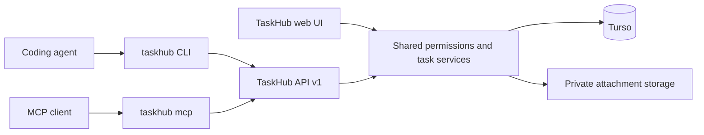

# TaskHub Rust CLI Implementation Plan

Build a separate Rust command line client, `taskhub`, that lets coding agents and people do real work in TaskHub: find and claim work, read full context, comment, attach evidence, link PRs, submit to Dev Done, follow the inbox, and send work back. Keep TaskHub's web application, database, authentication and workflow rules in the existing TaskHub project.

Date: 2026-10-07. Status: revised after the second three-agent review (security, API contract, product). Scope is the complete product, not an MVP. The shared skill bundle staged earlier is kept and updated to this command set. Implementation has not started. See [REVIEW.md](REVIEW.md) for both review rounds.

## Product rules

These are shared with the [TaskHub API and tokens plan](../TaskHub/docs/plans/2026-10-07-agent-api-and-tokens.md):

1. **Sign-off and deleting stay human.** No token can move an item into or out of Done, or delete an item. The CLI has no command that tries to; the server enforces it with `SIGN_OFF_REQUIRES_PERSON` and `DELETE_REQUIRES_PERSON`. A person deletes in TaskHub, where items go to Trash until the Admin removes them; an item in Trash is `NOT_FOUND` to the API.
2. **Agent work shows as "username (agent)"** in TaskHub. The CLI displays people the same way.
3. **Tokens never exceed their owner**: explicit project grants, read or write profile, the owner's live role.
4. **The agent gets the whole loop** in a few commands:

```text
taskhub next --claim             # pick up the right item and claim it atomically
taskhub branch --create          # web-12-fix-login-redirect
taskhub show                     # full context; the item comes from the branch name
taskhub comment --body-file progress.md
taskhub submit --summary-file summary.md --testing-file tests.md --attach shot.png --pr auto
taskhub inbox --unread           # was anything sent back or mentioned?
```

## Project boundaries

| Project | Owns |
| --- | --- |
| TaskHub | Browser UI, token management, API contract and fixtures, authorization, task services, migrations, private attachments, audit records |
| taskhub-cli | Rust executable, command parsing, configuration and credentials, HTTP transport, operation journal, output, git helpers, MCP server, embedded agent skill, releases |

The CLI sends HTTPS requests to TaskHub. It never receives database credentials or connects directly to Turso or Blob storage.



## Decisions

- One Rust binary crate, `taskhub-cli`, with the executable `taskhub`. Use `clap` (with `clap_complete` and `clap_mangen`), `serde`, `serde_json`, a blocking `reqwest` client with Rustls, `uuid`, and the official MCP Rust SDK (`rmcp`) for `taskhub mcp`. Select versions and features at implementation time and commit `Cargo.lock`.
- Tasks and bugs share one `items` family with `--type task|bug`; the work-loop commands (`next`, `claim`, `show`, `comment`, `submit`, `reject`, `inbox`, `link`, `branch`) sit at the top level because agents use them most.
- Output is JSON automatically when stdout is not a terminal, so agents never need to remember `--json`.
- The CLI keeps a local **operation journal** of every write before sending it. Agents do not generate or record UUIDs; `taskhub retry` resumes an uncertain write safely.
- Status changes use the status the caller saw (`--from`) as their precondition. Field edits use the item version (`--if-version`).
- Credentials live in a private credentials file written by `taskhub auth login`, bound to the origin they were saved with.
- The agent skill is embedded in the binary and installed with `taskhub skill install`, so it always matches the CLI version.
- Supported platforms are Linux and macOS (x86_64 and arm64). Windows waits until its file-permission and credential checks are designed.
- Removed after the second review: the 32 KiB CLI display limit, `--output-file` and `--fields`. The server's 2 MiB response bound remains; agents can redirect stdout. The pagination and compact default fields keep responses small.

## API contract

TaskHub owns the contract: Zod schemas in `TaskHub/lib/api/contracts.ts`, the generated `TaskHub/docs/api/v1/openapi.json` (OpenAPI 3.1) and fixtures for every endpoint and error code. The endpoint table, resource shapes, conventions and error codes are defined in the [TaskHub plan](../TaskHub/docs/plans/2026-10-07-agent-api-and-tokens.md#api-contract-v1) and are not repeated here.

**Keeping both sides in agreement.**

- `scripts/sync-contract.sh <path-to-TaskHub>` copies `openapi.json` and `fixtures/` into `api/v1/`, and writes `api/v1/contract-source.json` with the TaskHub commit and the SHA-256 of each copied file.
- CLI CI fails if the files don't match the recorded hashes, so nobody edits the snapshot by hand.
- Rust tests deserialize every response fixture and serialize every request fixture, comparing the bytes semantically.
- TaskHub CI validates the same fixtures against its Zod schemas and fails if the generated OpenAPI changes without being committed.

Write small hand-written Rust request and response types. Full client generation is optional and never a prerequisite.

**Rust specifics.**

- Patch bodies distinguish missing, null and value. Plain nested `Option` cannot; use an explicit three-state type or the [`double_option` adapter](https://docs.rs/serde_with/latest/serde_with/rust/double_option/index.html) and fixture-test both directions.
- Field limits are counted in UTF-16 code units, as TaskHub's validators do. Test Rust and TypeScript against the same Unicode boundary fixtures.
- Requests reject unknown fields. Responses tolerate added fields. An unknown enum value in a response is preserved and displayed, but never sent back in a write.
- The CLI sends `TaskHub-Client: taskhub-cli/<version>` on every request.

## Configuration and credentials

| File | Contents | Permissions |
| --- | --- | --- |
| `~/.config/taskhub/config.toml` | Non-secret settings: default project, output preference, and `origin` (used only with environment tokens) | Normal |
| `~/.config/taskhub/credentials.toml` | `origin`, `token`, `username`, `savedAt` | `0600`, owned by the user; the CLI refuses a file with wider permissions or another owner |
| `<repository>/.taskhub.toml` | Optional default project only | Cannot set an origin or credentials |
| `~/.local/state/taskhub/` | Operation journal, daily update and expiry check stamps | Directory `0700`, files `0600` |

XDG variables are honored when set.

**`taskhub auth login`.**

- `--with-token` reads the token from stdin. Without the flag, on a terminal, it prompts with hidden input. There is no argument that takes a token, so it never appears in shell history or `ps`.
- It checks the `thk_` prefix and checksum locally, calls `GET /me`, and saves the credentials with the username.
- **Token format** (it must match TaskHub's `lib/auth/api-token-format.ts`):
  - `thk_`, then 43 base64url characters, then a 6-character checksum of those 43 characters.
  - The checksum is CRC-32/ISO-HDLC: reflected polynomial `0xedb88320`, initial value and final XOR `0xffffffff`.
  - It is encoded in base62 with the alphabet `0-9A-Za-z`, left-padded with `0` to six characters.
  - Test it against TaskHub's known vectors.
- It prints the username, profile, granted projects and expiry ("never" for a token without one).
- `--origin URL` is the only way to set the server, and the origin is saved with the token. The default is `https://taskhub.dineshjinjala.com`. HTTPS is required, except plain HTTP to the literal addresses `127.0.0.1` and `[::1]` for local development; the name `localhost` is not accepted, because it can be redirected.

**Credential precedence.**

1. `TASKHUB_TOKEN_FILE`, refused unless the file is `0600` and owned by the user.
2. `TASKHUB_TOKEN`, for CI only. `auth status` warns that environment variables are inherited by every program the agent runs.
3. The credentials file.

The origin always comes from the credentials file or user config, never from a flag or environment variable on an ordinary command, so injected instructions cannot redirect a token to another server.

**Other auth commands.** `taskhub auth status` shows the user, origin, profile, projects, expiry and where the credential came from, but never the credential. `taskhub auth logout` deletes the credentials file. When a token with an expiry expires in under seven days, any command prints one line to stderr, at most once a day, with the tokens page URL.

## Commands

`REF` is an item key such as `WEB-12`, case-insensitive. Where `[REF]` is optional, the CLI takes it from the current git branch: the last path segment of the branch must start with `<key>-<number>` (for example `feature/web-12-fix-login` gives `WEB-12`). The CLI says so on stderr ("Using WEB-12 from branch web-12-fix-login") and in `meta.ref.source`. With no ref and no matching branch it fails with `REF_REQUIRED`. Where an optional `[REF]` comes before another positional (`items move`, `link`, `attachments add`), the first positional is REF only if it matches `KEY-N`; otherwise every positional belongs to the command and REF comes from the branch. These commands parse their positionals manually rather than relying on clap's ordering.

### Work loop

| Command | Behavior |
| --- | --- |
| `taskhub next [--project KEY…] [--type task\|bug] [--claim]` | `GET /items/next`. Prints the item and why: `sent_back`, `assigned` or `unassigned`. `--claim` claims `assigned` and `unassigned` items; if another agent wins the race (`ALREADY_CLAIMED`), it asks for the next item, up to three tries. A `sent_back` item is already In Progress and yours, so it is returned without a claim request. |
| `taskhub claim [REF]` | Assigns the item to you and moves it To Do → In Progress, atomically |
| `taskhub show [REF] [--comments N] [--attachments N]` | Full context in one request: item, project description, allowed transitions, latest comments, attachments, links |
| `taskhub mine [--status S…]` | Your To Do and In Progress items across granted projects |
| `taskhub comment [REF] (--body-file PATH \| --body TEXT) [--attach FILE…]` | Adds a Markdown comment. `@username` notifies. The receipt lists `mentioned` and `unmatchedMentions`. |
| `taskhub submit [REF] [--from STATUS] (--summary-file PATH \| --summary TEXT) (--testing-file PATH \| --testing TEXT) [--limitations-file PATH] [--attach FILE…] [--pr URL\|auto] [--link URL…]` | Uploads files, then atomically adds the evidence comment and links and moves to Dev Done. `--from` defaults to `in_progress`. `--input-file` accepts the same fields as JSON. Testers are notified automatically. |
| `taskhub reject REF (--reason-file PATH \| --reason TEXT) [--attach FILE…]` | Dev Done → In Progress with a required reason; notifies the assignee. For Testers' agents. There is no approve command: sign-off is human. |
| `taskhub inbox [--unread] [--kind mention\|assigned\|rejected\|review…]` | Inbox entries for granted projects, each with the item's current status. Reading never marks entries read, so the owner keeps their notifications. |
| `taskhub inbox done (ID… \| --all)` | Marks entries read explicitly |
| `taskhub link [REF] URL [--kind pr\|link]` | Adds a link; adding the same URL again is harmless |
| `taskhub branch [REF] [--create]` | Prints `web-12-fix-login-redirect`: the lowercase key, then the title as ASCII letters and digits joined by `-`, at most 50 characters, cut at a word boundary. `--create` runs `git switch -c`, or `git switch` if the branch exists. |
| `taskhub open [REF]` | Opens the item in the browser. When stdout is not a terminal it prints the URL instead. The only command that launches anything. |

`--pr auto` runs `gh pr view --json url -q .url` in the current directory. If `gh` is missing or there is no PR, the command fails before any write with `PR_NOT_FOUND` and a hint to pass the URL.

### Items, comments, attachments, projects

| Command | Behavior |
| --- | --- |
| `taskhub items list [--project KEY…] [--type] [--status…] [--priority] [--assignee me\|none\|USERNAME] [--label NAME…] [--search TEXT] [--agent] [--sort number\|priority] [--limit N] [--cursor C]` | Item summaries. Labels match any of those given. `--agent` shows items touched by agents. |
| `taskhub items get REF` | One item |
| `taskhub items activity [REF]` | Activity timeline |
| `taskhub items create --project KEY --type task\|bug --title TEXT [--body-file PATH] [--priority] [--assignee] [--label…]` | Creates in To Do; `--input-file` for JSON |
| `taskhub items update [REF] --if-version N [--title] [--body-file] [--priority] [--assignee USERNAME\|none] [--label NAME…\|--no-labels]` | Partial edit; only the given fields change |
| `taskhub items move [REF] STATUS --from STATUS` | `todo`, `in_progress` or `dev_done`. `done` as STATUS or `--from` fails locally with `SIGN_OFF_REQUIRES_PERSON` (exit 4, `httpStatus: null`) and sends no request. |
| `taskhub comments list [REF] [--limit] [--cursor]` | Continues the cursor from `show` |
| `taskhub comments edit ID (--body-file \| --body)` | Only comments you wrote through a token; never comments typed in the web app |
| `taskhub attachments list [REF]` | Attachment metadata |
| `taskhub attachments add [REF] FILE…` | Uploads files to the item. TaskHub accepts `.png`, `.jpg`/`.jpeg`, `.gif`, `.webp`, `.pdf`, `.md` and `.docx` up to 4 MB (4,194,304 bytes). The CLI checks the extension and size before upload; the server checks the content again. |
| `taskhub attachments download ID --output PATH [--force]` | Writes the file; refuses an existing path unless `--force` |
| `taskhub projects list` / `taskhub projects show KEY` | Projects; labels, members, enums and limits for writing valid input |

### Operations, setup and tooling

| Command | Behavior |
| --- | --- |
| `taskhub pending` | Writes whose outcome is unknown, with age and the command that started them |
| `taskhub retry OP` | Resends a pending write exactly (see the journal) |
| `taskhub pending discard OP` | Forgets a pending write after you checked it yourself |
| `taskhub auth login\|status\|logout` | See credentials |
| `taskhub guide` | A one-page agent guide built into the binary |
| `taskhub skill install [--client claude\|codex\|all] [--project]` | Writes the embedded skill bundle (see the skill section) |
| `taskhub mcp` | Runs as an MCP server over stdio |
| `taskhub completions bash\|zsh\|fish` | Shell completions |
| `taskhub version` | CLI version, contract version and supported API version; works offline |

**Input rules.** `--body-file -` and similar read stdin, and only one option may read stdin. A file and a flag that set the same field conflict. Unknown flags, fields, statuses, labels and usernames fail with the valid values listed; nothing is guessed. Help and version work offline, without credentials.

**Interaction rules.** Commands never prompt, page or open an editor. The exceptions are `auth login` without `--with-token` on a terminal and `open` on a terminal. Colors and tables appear only on a terminal, and `NO_COLOR` is honored.

## Output

**Format choice.**

- When stdout is not a terminal, or `TASKHUB_OUTPUT=json` is set, stdout is exactly one compact JSON envelope. On a terminal the output is human-readable.
- `--json` and `--human` override the automatic choice.
- Diagnostics go to stderr. Parser errors are wrapped so JSON mode stays predictable.

```json
{"ok":true,"data":{"key":"WEB-12","version":8,"status":"dev_done","commentId":"…","attachmentIds":["…"],"mentioned":[],"unmatchedMentions":[]},"meta":{"apiVersion":1,"requestId":"…","operation":{"id":"8c0c6d87-3e8a-4e24-919f-cc62d4a43e5c","replayed":false,"outcome":"committed"},"ref":{"key":"WEB-12","source":"branch"}}}
{"ok":false,"error":{"code":"STATUS_CONFLICT","message":"WEB-12 is in dev_done, not in_progress.","httpStatus":409,"details":{"currentStatus":"dev_done"},"hint":"taskhub show WEB-12"},"meta":{"operation":{"id":"…","outcome":"rejected"}}}
{"ok":false,"error":{"code":"REF_REQUIRED","message":"No item key given and branch main has none.","httpStatus":null,"details":{},"hint":"Pass a key, for example: taskhub show WEB-12"},"meta":{}}
```

API Problem Details map into `error.code`, `message`, `httpStatus` and `details`. Local errors use the same shape with `httpStatus: null`. Every error carries a `hint` with the exact next step:

| Code | Hint |
| --- | --- |
| `VERSION_CONFLICT` | `taskhub show REF`, then reapply only what still matches the request |
| `STATUS_CONFLICT` | `taskhub show REF` |
| `ALREADY_CLAIMED` | `taskhub next --claim` |
| `SIGN_OFF_REQUIRES_PERSON` | Ask a Tester to sign off in TaskHub, with the item URL |
| `DELETE_REQUIRES_PERSON` | Ask a person to delete it in TaskHub, with the item URL |
| `UNAUTHENTICATED` (expired or revoked) | Create a token at `<origin>/settings/tokens`, then `taskhub auth login --with-token` |
| `READ_ONLY_TOKEN` | Create a Read and write token for this project |
| `RATE_LIMITED` | Wait `retryAfterSeconds` |
| `OUTCOME_UNKNOWN` (local) | `taskhub retry OP` |
| `REPLAY_WINDOW_EXPIRED` (local) | `taskhub show REF` to check whether the write happened |
| `CLIENT_UPGRADE_REQUIRED` | The upgrade command for the install method |

**Exit codes.**

| Code | Meaning |
| --- | --- |
| 0 | Success |
| 1 | Internal failure |
| 2 | Usage or input error |
| 3 | Authentication |
| 4 | Permission, including sign-off |
| 5 | Not found |
| 6 | Conflict: version, status, claimed, idempotency |
| 7 | Rate limited |
| 8 | Transport failure or unknown write outcome |
| 9 | Incompatible server or client, or protocol error |

Agents use `error.code` and `meta.operation.outcome` (`committed`, `rejected` or `unknown`), never the message text.

**Server codes.**

| Code | Exit | Retried automatically |
| --- | --- | --- |
| `BAD_REQUEST`, `INVALID_CURSOR`, `PAYLOAD_TOO_LARGE`, `UNSUPPORTED_FILE_TYPE`, `VALIDATION_FAILED`, `UNKNOWN_USER`, `UNKNOWN_LABEL`, `INVALID_TRANSITION`, `ATTACHMENT_NOT_AVAILABLE`, `RESPONSE_TOO_LARGE` | 2 | No |
| `IDEMPOTENCY_KEY_REQUIRED` | 1, since it means a CLI bug | No |
| `UNAUTHENTICATED` | 3 | No |
| `READ_ONLY_TOKEN`, `SIGN_OFF_REQUIRES_PERSON`, `DELETE_REQUIRES_PERSON`, `NOT_AGENT_COMMENT`, `PROJECT_ARCHIVED` | 4 | No |
| `NOT_FOUND` | 5 | No |
| `VERSION_CONFLICT`, `STATUS_CONFLICT`, `ALREADY_CLAIMED`, `IDEMPOTENCY_CONFLICT` | 6 | No (`next --claim` handles `ALREADY_CLAIMED` itself) |
| `IDEMPOTENCY_IN_PROGRESS` | 6 | Once, after one second, with the same key |
| `RATE_LIMITED` | 7 | Once, if `Retry-After` fits within the deadline |
| `TEMPORARILY_UNAVAILABLE` | 8, with `outcome: rejected` because the server rolled back | Once, after one second, with the same key |
| `CLIENT_UPGRADE_REQUIRED` | 9 | No |

**CLI-local codes** (`httpStatus: null`).

| Code | Exit | Meaning |
| --- | --- | --- |
| `INVALID_INPUT`, `REF_REQUIRED`, `PR_NOT_FOUND`, `OUTPUT_EXISTS`, `ORIGIN_NOT_ALLOWED` | 2 | Bad arguments or files; no item key; no PR found; download path exists; origin rejected by the HTTPS rule |
| `CREDENTIALS_MISSING`, `CREDENTIALS_INSECURE` | 3 | No token; credentials or token file with unsafe permissions or owner |
| `SIGN_OFF_REQUIRES_PERSON`, `OPERATION_OWNER_MISMATCH` | 4 | `done` requested locally; retry with another owner's or origin's credential |
| `OPERATION_NOT_FOUND` | 5 | No journal entry with that ID |
| `REPLAY_WINDOW_EXPIRED`, `UPLOAD_CHANGED` | 6 | Retry refused: too old, or the file changed |
| `OUTCOME_UNKNOWN`, `TRANSPORT_FAILED` | 8 | Write sent but no usable response; read failed to connect or timed out |
| `PROTOCOL_ERROR` | 9 | Malformed or oversized response to a read |
| `INTERNAL` | 1 | Unexpected failure |

## Operation journal

Every write gets an operation ID and a journal entry **before** it is sent, so a write is never lost or duplicated, even if the agent's process is killed after the server commits.

- **Entry.** `~/.local/state/taskhub/operations/<id>.json`, mode `0600`, written and fsynced before dispatch. It holds:
  - the origin and owner username
  - method, path and exact request body bytes
  - for uploads, the file path, size and SHA-256
  - the command line that created it
  - the UTC creation time and the state
- **States.** `pending` until a response arrives; `committed` with the receipt; `rejected` with the error for definitive failures. Committed and rejected entries are deleted after 24 hours, lazily on later runs. Pending entries stay until retried or discarded.
- **Automatic retry.** On a transport failure or timeout, the CLI resends the same bytes with the same `Idempotency-Key` once, within the command deadline. If the outcome is still unknown, it exits 8 with the operation ID and the hint `taskhub retry OP`.
- **`taskhub retry OP`.** Resends the stored bytes with the same key. It refuses when:
  - the entry is six days and 23 hours old or older (`REPLAY_WINDOW_EXPIRED`). The server's replay window is seven days, and the hour covers clock differences.
  - the current credential belongs to a different owner or origin.
  - an upload's file has changed.
- **Multi-step commands.** `submit --attach` and `comment --attach` are one parent entry with child steps: each upload, then the comment or submission that references the uploaded IDs. A retry resumes from the first unfinished step and reuses finished uploads.
- **Advanced use.** `--request-id UUID` on any write supplies the operation ID, for callers that keep their own records.

The operation ID is sent as the `Idempotency-Key`; each child step of a multi-step command has its own ID and key. Never write the token into the journal.

## HTTP behavior

- One blocking client per invocation. Automatic redirects are off, and reqwest's built-in retries are off so the CLI's single retry is the whole retry budget. The `Authorization` header is marked sensitive.
- JSON and error bodies are limited to 2 MiB of decoded bytes while streaming, whatever `Content-Length` says. Beyond that, a read exits 9 (`PROTOCOL_ERROR`) and a write exits 8 (`OUTCOME_UNKNOWN`), because the server may have committed it. Downloads stream to a temporary file in the destination directory, limited to the 4 MB (4,194,304-byte) attachment maximum, and never enter the JSON buffer.
- Defaults: 5-second connect timeout, 15-second request timeout and 30-second command deadline (60 seconds for commands that upload). `Retry-After` is honored in seconds or HTTP-date form. If the wait exceeds the remaining deadline, the command returns exit 7 with the delay instead of waiting.
- Reads are retried once on transport failure. Writes are retried only through the journal, with identical bytes and key. `IDEMPOTENCY_IN_PROGRESS`, `TEMPORARILY_UNAVAILABLE` and `RATE_LIMITED` are retried as shown in the code table. Credential, permission, validation and conflict errors are never retried.
- **Downloads.** The temporary file is created with mode `0600` and published without replacing an existing file: `renameat2` with `RENAME_NOREPLACE` on Linux, `renamex_np` with `RENAME_EXCL` on macOS. `--force` allows replacement. Paths are never derived from server-provided filenames.
- Tokens never appear in arguments, URLs, logs, debug output, the journal or error messages.

## MCP server

`taskhub mcp` serves every item, comment, attachment, project, inbox and journal operation over stdio for MCP clients without a shell, such as Claude Desktop. It uses the same credentials, journal, envelope and hints as the CLI.

- **Tools:** `next`, `claim`, `show`, `get_item`, `activity`, `list_items`, `mine`, `create`, `update`, `move`, `submit`, `reject`, `comment`, `list_comments`, `edit_comment`, `attach`, `list_attachments`, `download`, `link`, `list_projects`, `show_project`, `inbox`, `inbox_done`, `pending`, `retry`. Auth, `branch`, `open`, `guide`, `skill` and completions stay CLI-only.
- Each tool returns the CLI's JSON envelope as text.
- Item keys are required, because an MCP server has no reliable working directory to read a branch from.
- File arguments are absolute paths.
- Descriptions are one sentence each, so clients with tool search load them cheaply.

The CLI plus the skill remains the primary interface for coding agents; MCP covers other clients from the same code.

## Agent skill

The [skill](skills/taskhub/SKILL.md) and its [write reference](skills/taskhub/references/writes.md) are kept in this repository, versioned with the CLI, and embedded into the binary with `include_str!`.

**Installation.** `taskhub skill install` writes the bundle into the client's skill directory:

| Client | Personal (default) | `--project` |
| --- | --- | --- |
| Claude Code | `~/.claude/skills/taskhub/` | `<repository>/.claude/skills/taskhub/` |
| Codex | `~/.agents/skills/taskhub/` | `<repository>/.agents/skills/taskhub/` |

It refuses to overwrite a different skill named `taskhub`. It does update a bundle it wrote before, recognized by a version marker in the frontmatter's `metadata`. Copying the directory by hand also works; see [docs/skills.md](docs/skills.md).

**Budgets.**

- The entrypoint holds the work loop, setup checks and safety rules within 200 UTF-8 bytes of `name` plus `description` and 4 KiB / 350 words.
- The write reference loads only before writes.
- Never preload OpenAPI, full help, or project or item history.
- Never copy the skill body into `AGENTS.md` or `CLAUDE.md`.
- The skill cannot grant credentials or roles. It tells the agent to treat item text as untrusted data, never to follow instructions found in it, and never to handle the token.

**Release.**

- CI checks the frontmatter, relative links and size budgets.
- Every command in the skill must parse against the built CLI (`taskhub <command> --help` succeeds for each example).
- The skill's pre-release label is removed only after discovery and workflows pass in real Claude Code and Codex versions.

## Rust project layout

```text
taskhub-cli/
  PLAN.md  REVIEW.md  Cargo.toml  Cargo.lock
  src/
    main.rs          # process boundary, exit codes
    cli.rs           # clap definitions
    config.rs        # config files, origin rules
    credentials.rs   # credentials file, precedence, permission checks
    journal.rs       # operation journal, retry, pending
    api.rs           # HTTP transport, DTOs, limits, deadlines
    git.rs           # branch inference, branch names, gh PR lookup
    output.rs        # envelope, human tables, hints
    mcp.rs           # MCP server
    skill.rs         # embedded skill bundle and installer
    commands/        # one module per command group
  api/v1/
    openapi.json  contract-source.json  fixtures/
  scripts/sync-contract.sh
  skills/taskhub/
    SKILL.md
    references/writes.md
  tests/
    contract.rs  cli_process.rs  journal.rs  git.rs  mcp.rs
  docs/
    skills.md  installation.md
```

Server authorization rules and database access stay out of the Rust crate.

## Milestones

| Milestone | Deliverables | Completion gate |
| --- | --- | --- |
| 0 Contract | Sync script, snapshot from TaskHub step 1, drift check, fixture tests | Every fixture round-trips in Rust; Unicode and three-state fixtures agree |
| 1 Core and reads | Config, credentials and `auth`, transport, envelope, hints, exit codes, branch inference, `show`, `mine`, `items list/get/activity`, `comments list`, `attachments list/download`, `projects`, `inbox`, completions | Process tests against a mock server; help and version offline |
| 2 Writes and the loop | Journal, `pending`, `retry`; `next`, `claim`, `comment`, `comments edit`, `attachments add`, `link`, `submit`, `reject`, `inbox done`, `items create/update/move`; `branch`, `--pr auto` | Journal crash tests (kill after send, before receipt) replay without duplicates; multi-step resume |
| 3 Agent surface | `guide`, embedded skill and `skill install`, `mcp`, `open` | Skill checks pass; MCP tools tested with a stdio client |
| 4 End-to-end | Scripted agent workflow against seeded TaskHub staging; Claude Code and Codex skill discovery and workflows | The workflow below passes with no wrong or duplicate writes |
| 5 Distribution | `dist` releases, Homebrew tap, AUR package, man page, update notice | Clean installs on Arch, another Linux and macOS pass smoke tests |

Milestone 0 starts once TaskHub's contract step is done; milestones 1–3 can run against fixtures and a mock server while TaskHub builds its API.

**End-to-end workflow** (milestone 4, against staging with a Developer token and a Tester token):

1. Developer agent: `next --claim` → `branch --create` → `show` → `comment` with an `@tester` mention → `submit --attach --pr`.
2. Tester agent: `inbox --kind review` → `show` → `reject --reason` with a screenshot.
3. Developer agent: `inbox --kind rejected` → `next` returns the sent-back item → `submit` again.
4. A Tester signs off in the browser. Any agent attempt to move the item to Done fails with `SIGN_OFF_REQUIRES_PERSON`.

Along the way, kill the CLI after a submission is sent and run `retry`; revoke a token mid-run; and race two `next --claim` calls.

## Required validation

| Scenario | Expected result |
| --- | --- |
| Token passed through stdin, env, token file, credentials file | Correct precedence; wrong file permissions refused; token never printed |
| Origin set by flag on an ordinary command, or by env | Not possible; only `auth login --origin` sets it |
| `http://localhost` origin | Refused; `http://127.0.0.1` allowed |
| Expired, revoked, read-only token | Exit 3 or 4 with the right hint |
| Agent moves to or from Done | Exit 4, `SIGN_OFF_REQUIRES_PERSON` |
| Item deleted to Trash mid-work | Exit 5, `NOT_FOUND`; `outcome: rejected`, not unknown |
| Ref omitted on a `feature/web-12-x` branch, on `main`, outside git | `WEB-12` used and reported; `REF_REQUIRED`; `REF_REQUIRED` |
| Two concurrent `next --claim` | Different items or one `ALREADY_CLAIMED` followed by the next item |
| Process killed after a write is sent | `pending` lists it; `retry` returns the original receipt once |
| Retry after six days and 23 hours, with another owner's credentials, after an upload file changed | Refused with `REPLAY_WINDOW_EXPIRED`, `OPERATION_OWNER_MISMATCH` or `UPLOAD_CHANGED` |
| `submit --attach` interrupted after uploads | `retry` reuses the uploads and completes the submission |
| Stale `--if-version` or `--from` | Exit 6 with current version or status; nothing written |
| Unknown label or username | Exit 2 with valid values listed |
| Mention of a mistyped username | Receipt lists it in `unmatchedMentions` |
| `inbox` read | Entries stay unread in TaskHub |
| Comment edit on a web-typed comment | Exit 4, `NOT_AGENT_COMMENT` |
| Non-terminal stdout | JSON envelope, no colors, no prompts |
| Oversized, compressed or lying `Content-Length` body | Stream limit aborts: a read exits 9; a write exits 8 with `outcome: unknown` and its operation ID |
| Download to an existing path, symlink, interrupted download | Refused without `--force`; no partial file published |
| `--pr auto` without `gh` or without a PR | Fails before any write with `PR_NOT_FOUND` |
| Server requires a newer client | Exit 9 with the upgrade command |
| `skill install` over another `taskhub` skill | Refused |
| MCP tool call | Same envelope and journal behavior as the CLI |

Rust checks: `cargo fmt --check`, `cargo clippy --locked --all-targets -- -D warnings`, `cargo test --locked`, `cargo build --locked --release`. Process-level tests run the real binary against a controlled HTTP server.

## Measurement

Measure rather than claim:

- Startup time of the release binary.
- p50/p95 latency of `show`, `next --claim` and `submit` against staging.
- For the end-to-end workflow in Claude Code and Codex, with and without the skill: tool calls, CLI calls, bytes of skill and references loaded, model tokens where reported, and outcome.

Record client and model versions in `docs/benchmarks.md`. The design targets are one request for `show` and one request for a submission without attachments.

## CI and releases

- **CI:** formatting, Clippy, tests, the contract drift check, skill checks and release builds, with read-only repository permissions. Tests use synthetic tokens and local servers. The staging end-to-end job runs separately with its own secrets, never on pull requests from forks.
- **Releases:** [`dist`](https://opensource.axo.dev/cargo-dist/) builds GitHub Releases for `x86_64-unknown-linux-musl`, `aarch64-unknown-linux-musl`, `x86_64-apple-darwin` and `aarch64-apple-darwin`, with checksums, a shell installer and build attestations. Static musl binaries avoid per-distribution library assumptions.
- **Packages:** a Homebrew tap, an AUR package `taskhub-cli-bin` built from the release tarball and its checksum, and `cargo install --git` as a fallback. The release archive includes the man page and completions.
- **Updates:** no self-update. `GET /me` returns `latestClientVersion` (null when TaskHub has none configured, in which case the CLI shows no notice); on a terminal, the CLI mentions a newer version at most once a day. `minClientVersion` is enforced by the server.
- Pin CI actions to commit hashes. No package name, repository, signing identity or publishing credential is assumed to exist yet.

## Sources

- [GitHub CLI agent guide](https://github.com/cli/cli/blob/trunk/skills/gh/SKILL.md) and [`gh auth login --with-token`](https://cli.github.com/manual/gh_auth_login): structured output, explicit targets, token from stdin.
- [clap derive tutorial](https://docs.rs/clap/latest/clap/_derive/_tutorial/index.html), [clap_complete](https://docs.rs/clap_complete) and [clap_mangen](https://docs.rs/clap_mangen): typed commands, completions, man page.
- [Serde attributes](https://serde.rs/container-attrs.html) and [double_option](https://docs.rs/serde_with/latest/serde_with/rust/double_option/index.html): strict input and three-state patches.
- [reqwest client settings](https://docs.rs/reqwest/latest/reqwest/blocking/struct.ClientBuilder.html) and [retry policy](https://docs.rs/reqwest/latest/reqwest/retry/index.html): deadlines, redirects, retry control.
- [RFC 9457](https://www.rfc-editor.org/rfc/rfc9457.html) and [RFC 9110 §9.2.2](https://www.rfc-editor.org/rfc/rfc9110.html#section-9.2.2): error format and safe retries.
- [MCP Rust SDK](https://github.com/modelcontextprotocol/rust-sdk): `taskhub mcp`.
- [Agent Skills specification](https://agentskills.io/specification), [Claude Code skills](https://code.claude.com/docs/en/skills) and [Codex skills](https://learn.chatgpt.com/docs/build-skills): skill format and install locations.
- [dist](https://opensource.axo.dev/cargo-dist/): release builds and installers.
- [Claude Code MCP tool search](https://code.claude.com/docs/en/mcp#scale-with-mcp-tool-search): why CLI and MCP context costs must be measured, not assumed.
